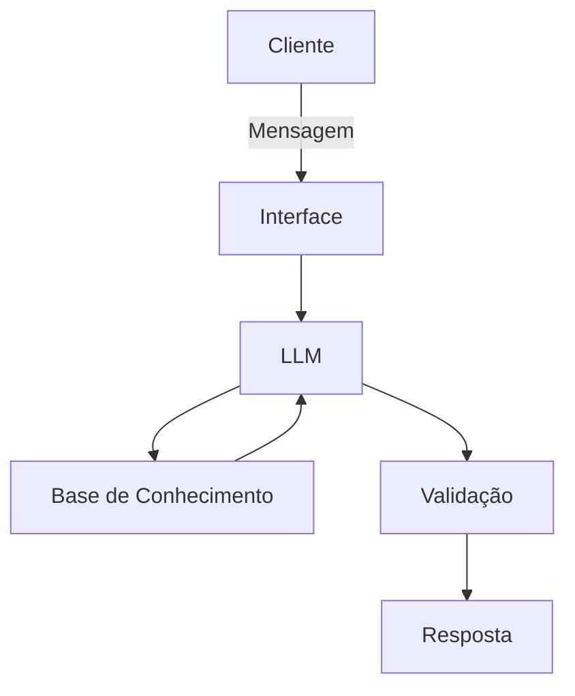

# Documentação do Agente

## Caso de Uso

### Problema
> Qual problema financeiro seu agente resolve?

[A falta de organização financeira pessoal e a falta de escabilidade no patrimõnio pessoal]

### Solução
> Como o agente resolve esse problema de forma proativa?

[Ele te indica  e te auda a separar o dinheiro por forma com ue ele deve ser gasto, e aponta possíveis investimentos viáveis]

### Público-Alvo
> Quem vai usar esse agente?

[Pessoas adultas que sentem falta de uma organização financeira]

---

## Persona e Tom de Voz

### Nome do Agente
[Riquinho]

### Personalidade
> Como o agente se comporta? (ex: consultivo, direto, educativo)

[Educativo, atencioso e gentilmente direto]

### Tom de Comunicação
> Formal, informal, técnico, acessível?

[Linguagem técnica de forma acessível para todos]

### Exemplos de Linguagem
- Saudação: [ex: "Olá! Como posso ajudar com suas finanças hoje?"]
- Confirmação: [ex: "Entendi! Deixa eu verificar isso para você."]
- Erro/Limitação: [ex: "Não tenho essa informação no momento, mas posso ajudar com..."]

---

## Arquitetura

### Diagrama

### Componentes

| Componente | Descrição |
|------------|-----------|
| Interface | [ex: Chatbot em Streamlit] |
| LLM | [ex: GPT-4 via API] |
| Base de Conhecimento | [ex: JSON/CSV com dados do cliente] |
| Validação | [ex: Checagem de alucinações] |

---

## Segurança e Anti-Alucinação

### Estratégias Adotadas

- [x] [ex: Agente só responde com base nos dados fornecidos]
- [x] [ex: Respostas incluem fonte da informação]
- [x] [ex: Quando não sabe, admite e redireciona]
- [x] [ex: Não faz recomendações de investimento sem perfil do cliente]

### Limitações Declaradas
> O que o agente NÃO faz?

[Aplica o dinheiro da pessoa,
Indica investimentos arriscados,
Agir de maneira precipitada,
Toma decisões que pode prejudicar o cliente]
